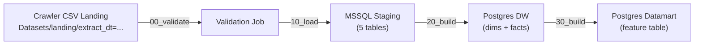

# Pentaho Pipeline Guide — Steam Crawler → MSSQL Staging → Postgres DW → Datamart

This guide walks through every Pentaho Job/Transform you need to build, what nodes to use, how to connect them, and the SQL DDL for each database layer.

---

## Overview of the full pipeline



The crawler drops these CSVs per partition:

| File | Columns | Staging table |
|---|---|---|
| `players.csv` | playerid, country, created | `stg_players` |
| `history.csv` | playerid, achievementid, date_acquired | `stg_history` |
| `reviews.csv` | reviewid, playerid, gameid, review, helpful, funny, awards, posted | `stg_reviews` |
| `purchased_games.csv` | playerid, library | `stg_library_raw` |
| `private_steamids.csv` | playerid | `stg_private_steamids` |

---

## Prerequisites

1. **Docker containers running** — `docker compose up -d mssql-staging postgres-warehouse`
2. **Pentaho Data Integration (PDI/Spoon)** installed locally
3. **JDBC drivers** — MSSQL (`mssql-jdbc-*.jar`) and PostgreSQL (`postgresql-*.jar`) in `data-integration/lib/`
4. Two DB connections configured in Spoon (see §1 below)

---

## §0 — SQL DDL: Create All Tables First

Run these scripts **before** building the Pentaho transforms.

### 0A — MSSQL Staging (run via `sqlcmd` or SSMS)

```sql
USE DW_Staging;
GO

-- Landing audit log
CREATE TABLE dbo.stg_load_audit (
    audit_id         INT IDENTITY(1,1) PRIMARY KEY,
    extract_dt       NVARCHAR(50)   NOT NULL,
    loaded_at        DATETIME2      NOT NULL DEFAULT SYSUTCDATETIME(),
    status           NVARCHAR(20)   NOT NULL,  -- 'success' | 'failed'
    players_rows     INT,
    history_rows     INT,
    reviews_rows     INT,
    library_rows     INT,
    private_rows     INT,
    error_message    NVARCHAR(MAX)
);
GO

-- Players staging
CREATE TABLE dbo.stg_players (
    playerid     NVARCHAR(30)  NOT NULL,
    country      NVARCHAR(10),
    created      NVARCHAR(30),
    extract_dt   NVARCHAR(50)  NOT NULL,
    loaded_at    DATETIME2     NOT NULL DEFAULT SYSUTCDATETIME()
);
GO

-- Achievement history staging
CREATE TABLE dbo.stg_history (
    playerid        NVARCHAR(30)  NOT NULL,
    achievementid   NVARCHAR(200) NOT NULL,
    date_acquired   NVARCHAR(30),
    extract_dt      NVARCHAR(50)  NOT NULL,
    loaded_at       DATETIME2     NOT NULL DEFAULT SYSUTCDATETIME()
);
GO

-- Reviews staging
CREATE TABLE dbo.stg_reviews (
    reviewid    NVARCHAR(30)  NOT NULL,
    playerid    NVARCHAR(30)  NOT NULL,
    gameid      NVARCHAR(30),
    review      NVARCHAR(MAX),
    helpful     INT,
    funny       INT,
    awards      INT,
    posted      NVARCHAR(30),
    extract_dt  NVARCHAR(50)  NOT NULL,
    loaded_at   DATETIME2     NOT NULL DEFAULT SYSUTCDATETIME()
);
GO

-- Library raw staging (list-string stays as-is)
CREATE TABLE dbo.stg_library_raw (
    playerid            NVARCHAR(30)  NOT NULL,
    library_list_string NVARCHAR(MAX),
    extract_dt          NVARCHAR(50)  NOT NULL,
    loaded_at           DATETIME2     NOT NULL DEFAULT SYSUTCDATETIME()
);
GO

-- Private Steam IDs staging
CREATE TABLE dbo.stg_private_steamids (
    playerid    NVARCHAR(30) NOT NULL,
    extract_dt  NVARCHAR(50) NOT NULL,
    loaded_at   DATETIME2    NOT NULL DEFAULT SYSUTCDATETIME()
);
GO
```

### 0B — Postgres DW + Datamart (run via `psql`)

```sql
-- Connect to the Warehouse database

-- DW schema
CREATE SCHEMA IF NOT EXISTS dw;

CREATE TABLE IF NOT EXISTS dw.dim_player (
    playerid    VARCHAR(30) PRIMARY KEY,
    country     VARCHAR(10),
    created     TIMESTAMP,
    first_seen_dt  VARCHAR(50),
    last_seen_dt   VARCHAR(50),
    updated_at  TIMESTAMP DEFAULT NOW()
);

CREATE TABLE IF NOT EXISTS dw.fact_achievement_unlock (
    playerid        VARCHAR(30) NOT NULL,
    achievementid   VARCHAR(200) NOT NULL,
    gameid          VARCHAR(30),      -- derived: split achievementid on '_'
    date_acquired   TIMESTAMP,
    extract_dt      VARCHAR(50) NOT NULL,
    PRIMARY KEY (playerid, achievementid)
);

CREATE TABLE IF NOT EXISTS dw.fact_review (
    reviewid    VARCHAR(30) PRIMARY KEY,
    playerid    VARCHAR(30) NOT NULL,
    gameid      VARCHAR(30),
    review      TEXT,
    helpful     INTEGER DEFAULT 0,
    funny       INTEGER DEFAULT 0,
    awards      INTEGER DEFAULT 0,
    posted      DATE,
    extract_dt  VARCHAR(50) NOT NULL
);

CREATE TABLE IF NOT EXISTS dw.fact_library (
    playerid    VARCHAR(30) NOT NULL,
    appid       VARCHAR(30) NOT NULL,
    extract_dt  VARCHAR(50) NOT NULL,
    PRIMARY KEY (playerid, appid)
);

-- Datamart schema
CREATE SCHEMA IF NOT EXISTS dm;

CREATE TABLE IF NOT EXISTS dm.dm_steam_player_features_v1 (
    playerid                        VARCHAR(30) PRIMARY KEY,
    country                         VARCHAR(10),
    account_age_days                DOUBLE PRECISION,
    library_size                    INTEGER,
    total_achievements              INTEGER,
    achievement_game_ratio          DOUBLE PRECISION,
    total_reviews                   INTEGER,
    avg_review_length               DOUBLE PRECISION,
    min_review_length               DOUBLE PRECISION,
    review_duplication_rate         DOUBLE PRECISION,
    refreshed_at                    TIMESTAMP DEFAULT NOW()
);

CREATE TABLE IF NOT EXISTS dm.dm_datamart_refresh_log (
    refresh_id   SERIAL PRIMARY KEY,
    refreshed_at TIMESTAMP DEFAULT NOW(),
    player_count INTEGER,
    status       VARCHAR(20)
);
```

> [!NOTE]
> The full 25-feature set from the integration doc (`median_unlock_interval_sec`, `night_activity_ratio`, etc.) requires complex time-series calculations. Start with the columns above — Pentaho can compute them. Add columns to `dm_steam_player_features_v1` as you build each feature in Pentaho transforms.

---

## §1 — Create DB Connections in Spoon

Open Spoon → **View** tab → right-click **Database connections** → **New**.

### Connection 1: `MSSQL_Staging`

| Field | Value |
|---|---|
| Connection Name | `MSSQL_Staging` |
| Connection Type | `MS SQL Server (Native)` |
| Host | `localhost` |
| Database | `DW_Staging` |
| Port | `1433` |
| Username | `sa` |
| Password | `31082004@Lmao` |
| Extra: trustServerCertificate | `true` |

### Connection 2: `Postgres_Warehouse`

| Field | Value |
|---|---|
| Connection Name | `Postgres_Warehouse` |
| Connection Type | `PostgreSQL` |
| Host | `localhost` |
| Database | `Warehouse` |
| Port | `5432` |
| Username | `postgres` |
| Password | `31082004@Lmao` |

> [!TIP]
> Test both connections with the **Test** button before proceeding.

---

## §2 — Job: `00_validate_landing.kjb`

**Purpose:** Find all unprocessed landing partitions by diffing the `landing/` directory against the `stg_load_audit` table, then validate each candidate before passing it downstream.

> [!NOTE]
> This uses the **Database Audit Log Method** — Pentaho queries `stg_load_audit` for previously loaded `extract_dt` values and only selects landing folders that haven't been ingested yet. The file system stays completely read-only (no moving/archiving files) and every load is recorded as a queryable audit trail.

### Job canvas — nodes and connections

```
[START] ──(unconditional)──▶ [Set LANDING_ROOT var]
    ──(success)──▶ [Find unprocessed partitions (Transform)]
    ──(success)──▶ [Check _SUCCESS exists]
    ──(success)──▶ [Validate required files]
    ──(success)──▶ [Success ✓]
    ──(failure)──▶ [Abort / Log error ✗]
```

### Node-by-node

#### Node 1: `Set LANDING_ROOT` — **Set Variables** (Job entry)
- Variable `LANDING_ROOT` = `${Internal.Entry.Current.Directory}/../Datasets/landing`
- Scope: Valid in the root job

#### Node 2: `Find unprocessed partitions` — **Transformation** (Job entry)

This runs a transform (`00_find_unprocessed_partitions.ktr`) that diffs filesystem folders against the audit table. The transform canvas:

```
[Get File Names] ──▶ [Extract extract_dt from folder name] ──┐
                                                              ├──▶ [Merge Join (LEFT OUTER)] ──▶ [Filter: audit_extract_dt IS NULL] ──▶ [Filter: _SUCCESS exists] ──▶ [Sort descending] ──▶ [Sample 1] ──▶ [Set Variables]
[Table Input: loaded partitions] ─────────────────────────────┘
```

**Step 2a: Get File Names**
- Directory: `${LANDING_ROOT}`
- Include subdirectories: **No**
- Filter: directories only
- This produces rows with `short_filename` = `extract_dt=2026-04-24T150443Z`

**Step 2b: Replace in String** — extract the `extract_dt` value
- In field: `short_filename`
- Out field: `folder_extract_dt`
- Search: `extract_dt=` → Replace with: `` (empty)
- Result: `2026-04-24T150443Z`

**Step 2c: Table Input — loaded partitions**
- Connection: `MSSQL_Staging`
- SQL:
  ```sql
  SELECT extract_dt AS audit_extract_dt
  FROM dbo.stg_load_audit
  WHERE status = 'success'
  ```
- Sort: `ORDER BY audit_extract_dt`

**Step 2d: Merge Join** (or Stream Lookup)
- Type: `LEFT OUTER`
- Left: folder list (sorted by `folder_extract_dt`)
- Right: audit table results (sorted by `audit_extract_dt`)
- Key: `folder_extract_dt = audit_extract_dt`

**Step 2e: Filter Rows — unprocessed only**
- Condition: `audit_extract_dt IS NULL`
- True path → continue (this partition hasn't been loaded yet)
- False path → discard (already loaded)

**Step 2f: Modified Java Script Value — check _SUCCESS**
- Script:
  ```javascript
  var success_file = new java.io.File(
      landing_root + "/extract_dt=" + folder_extract_dt + "/_SUCCESS"
  );
  var has_success = success_file.exists();
  ```
- Output field: `has_success` (Boolean)

**Step 2g: Filter Rows — _SUCCESS exists**
- Condition: `has_success = true`

**Step 2h: Sort rows**
- Sort by `folder_extract_dt` descending (newest first)

**Step 2i: Sample rows**
- Limit: 1 (process one partition per run)

**Step 2j: Set Variables**
- `LATEST_PARTITION` = `folder_extract_dt`
- `PARTITION_PATH` = `${LANDING_ROOT}/extract_dt=${folder_extract_dt}`

> [!TIP]
> If you want to process **all** unprocessed partitions in a single run (not just the newest), remove the Sort + Sample steps and instead have the master job loop over each result row using **Execute for each row**.

#### Node 3: `Validate required files` — **Transformation** (Job entry) *(optional)*
- Check that `players.csv`, `history.csv`, `reviews.csv`, `purchased_games.csv`, `private_steamids.csv` exist in `${PARTITION_PATH}`
- Optionally read `manifest.json` and validate row counts / schema version
- On failure → abort

#### Node 4: `Success` — **Success** (Job entry)

#### Node 5: `Abort` — **Abort job** (Job entry)

---

## §3 — Transforms: `10_load_mssql_staging_*.ktr`

Build **one transform per CSV file**. Each follows the same pattern:

```
[CSV File Input] ──▶ [Add extract_dt constant] ──▶ [Select Values] ──▶ [Table Output → MSSQL]
```

### 3A — `10_load_mssql_staging_players.ktr`

#### Step 1: **CSV File Input**
- Filename: `${PARTITION_PATH}/players.csv`
- Separator: `,`
- Enclosure: `"`
- Header: Yes
- Fields:
  | Name | Type | Length |
  |---|---|---|
  | playerid | String | 30 |
  | country | String | 10 |
  | created | String | 30 |

#### Step 2: **Add constants**
- Field: `extract_dt`, Type: String, Value: `${LATEST_PARTITION}`
  - (This is the `extract_dt=2026-04-24T150443Z` partition name)

#### Step 3: **Select Values**
- Keep: playerid, country, created, extract_dt
- (Rename `library` → `library_list_string` in the library transform)

#### Step 4: **Table Output**
- Connection: `MSSQL_Staging`
- Target schema: `dbo`
- Target table: `stg_players`
- Commit size: 1000
- Truncate table: **Yes** (full refresh per run — or No if you want append-mode)
- Field mapping: all fields auto-mapped by name

#### Hop wiring
```
CSV File Input ──▶ Add constants ──▶ Select Values ──▶ Table Output
```

---

### 3B — `10_load_mssql_staging_history.ktr`

Same pattern. Fields:

| CSV column | Type | MSSQL column |
|---|---|---|
| playerid | String(30) | playerid |
| achievementid | String(200) | achievementid |
| date_acquired | String(30) | date_acquired |
| *(added)* extract_dt | String(50) | extract_dt |

---

### 3C — `10_load_mssql_staging_reviews.ktr`

Fields:

| CSV column | Type | MSSQL column |
|---|---|---|
| reviewid | String(30) | reviewid |
| playerid | String(30) | playerid |
| gameid | String(30) | gameid |
| review | String(max) | review |
| helpful | Integer | helpful |
| funny | Integer | funny |
| awards | Integer | awards |
| posted | String(30) | posted |
| *(added)* extract_dt | String(50) | extract_dt |

---

### 3D — `10_load_mssql_staging_library.ktr`

Fields:

| CSV column | Type | MSSQL column |
|---|---|---|
| playerid | String(30) | playerid |
| library | String(max) | library_list_string |
| *(added)* extract_dt | String(50) | extract_dt |

> [!IMPORTANT]
> Use **Select Values** to rename `library` → `library_list_string` before the Table Output step.

---

### 3E — `10_load_mssql_staging_private.ktr`

Fields:

| CSV column | Type | MSSQL column |
|---|---|---|
| playerid | String(30) | playerid |
| *(added)* extract_dt | String(50) | extract_dt |

---

## §4 — Transforms: `20_build_postgres_dw_*.ktr`

These read from MSSQL staging and upsert into Postgres DW. Build **one transform per DW table**.

### 4A — `20_build_postgres_dw_dim_player.ktr`

```
[Table Input (MSSQL)] ──▶ [Select Values / Type cast] ──▶ [Insert/Update (Postgres)]
```

#### Step 1: **Table Input**
- Connection: `MSSQL_Staging`
- SQL:
  ```sql
  SELECT playerid, country, created, extract_dt
  FROM dbo.stg_players
  WHERE extract_dt = ?
  ```
  - Pass `${LATEST_PARTITION}` as parameter (or omit the WHERE for full load)
  - **Simpler approach:** Just `SELECT playerid, country, created, extract_dt FROM dbo.stg_players`

#### Step 2: **Select Values / Modified JavaScript**
- Parse `created` string → Timestamp (use **Select Values** → Meta-data tab → set format `yyyy-MM-dd HH:mm:ss`)
- Add a constant `last_seen_dt` = `${LATEST_PARTITION}`
- Add a constant `first_seen_dt` = `${LATEST_PARTITION}` (will be used only on INSERT)

#### Step 3: **Insert/Update**
- Connection: `Postgres_Warehouse`
- Target schema: `dw`
- Target table: `dim_player`
- Key lookup:
  | Table field | Comparator | Stream field |
  |---|---|---|
  | playerid | = | playerid |
- Update fields:
  | Table field | Stream field | Update? |
  |---|---|---|
  | playerid | playerid | N (key) |
  | country | country | Y |
  | created | created | Y |
  | last_seen_dt | last_seen_dt | Y |
  | first_seen_dt | first_seen_dt | N (insert only) |

#### Hop wiring
```
Table Input ──▶ Select Values ──▶ Insert/Update
```

---

### 4B — `20_build_postgres_dw_fact_achievement.ktr`

```
[Table Input (MSSQL)] ──▶ [Modified JavaScript: parse gameid] ──▶ [Select Values] ──▶ [Insert/Update (Postgres)]
```

#### Step 1: **Table Input**
- Connection: `MSSQL_Staging`
- SQL: `SELECT playerid, achievementid, date_acquired, extract_dt FROM dbo.stg_history`

#### Step 2: **Modified Java Script Value**
- Purpose: derive `gameid` from `achievementid` (format: `{appid}_{apiname}`)
- Script:
  ```javascript
  var parts = achievementid.split("_");
  var gameid = parts[0];  // everything before the first underscore
  ```
- Output field: `gameid` (String)

#### Step 3: **Select Values**
- Meta-data: convert `date_acquired` from String → Timestamp (format: `yyyy-MM-dd HH:mm:ss`)
- Keep: playerid, achievementid, gameid, date_acquired, extract_dt

#### Step 4: **Insert/Update**
- Connection: `Postgres_Warehouse`
- Schema: `dw`, Table: `fact_achievement_unlock`
- Key: `(playerid, achievementid)`
- Update: date_acquired, extract_dt

---

### 4C — `20_build_postgres_dw_fact_review.ktr`

```
[Table Input (MSSQL)] ──▶ [Select Values (type cast)] ──▶ [Insert/Update (Postgres)]
```

#### Step 1: **Table Input**
- SQL: `SELECT reviewid, playerid, gameid, review, helpful, funny, awards, posted, extract_dt FROM dbo.stg_reviews`

#### Step 2: **Select Values**
- Meta-data: convert `posted` → Date (format: `yyyy-MM-dd`)
- Keep all fields

#### Step 3: **Insert/Update**
- Connection: `Postgres_Warehouse`
- Schema: `dw`, Table: `fact_review`
- Key: `reviewid`
- Update all non-key fields

---

### 4D — `20_build_postgres_dw_fact_library.ktr` ⭐ (Library explode)

This is the most complex transform — it parses the `[a, b, c]` list-string into one row per `(playerid, appid)`.

```
[Table Input (MSSQL)] ──▶ [Modified JavaScript: clean string] ──▶ [Split field to rows] ──▶ [String trim] ──▶ [Add extract_dt] ──▶ [Insert/Update (Postgres)]
```

#### Step 1: **Table Input**
- Connection: `MSSQL_Staging`
- SQL: `SELECT playerid, library_list_string, extract_dt FROM dbo.stg_library_raw`

#### Step 2: **Modified Java Script Value**
- Purpose: strip brackets `[` `]` from the list string
- Script:
  ```javascript
  var cleaned_library = library_list_string;
  if (cleaned_library != null) {
      cleaned_library = cleaned_library.replace(/^\[/, '').replace(/\]$/, '').trim();
  }
  ```
- Output field: `cleaned_library` (String)

#### Step 3: **Split field to rows**
- Field to split: `cleaned_library`
- Delimiter: `,`
- New field name: `appid`
- (This creates one row per comma-separated value)

#### Step 4: **String operations** (or **Select Values** trim)
- Trim whitespace from `appid`
- Filter out empty/null `appid` rows using a **Filter rows** step:
  - Condition: `appid IS NOT NULL AND appid != ''`

#### Step 5: **Select Values**
- Keep: playerid, appid, extract_dt

#### Step 6: **Insert/Update**
- Connection: `Postgres_Warehouse`
- Schema: `dw`, Table: `fact_library`
- Key: `(playerid, appid)`
- Update: extract_dt

#### Full hop wiring
```
Table Input ──▶ Modified JavaScript ──▶ Split field to rows ──▶ Filter rows ──▶ Select Values ──▶ Insert/Update
```

> [!WARNING]
> Large libraries (500+ games per player) will produce many rows. Set the **commit size** on the Insert/Update step to 5000 for performance.

---

## §5 — Transforms: `30_build_datamart_features.ktr`

This transform reads from the Postgres DW and builds the feature table.

```
[Table Input: player base] ──┐
[Table Input: library counts] ──┤──▶ [Merge Join on playerid] ──▶ ... ──▶ [Insert/Update → dm.dm_steam_player_features_v1]
[Table Input: achievement counts] ──┘
```

### Detailed step-by-step

#### Step 1a: **Table Input — Player base**
- Connection: `Postgres_Warehouse`
- SQL:
  ```sql
  SELECT p.playerid, p.country, p.created,
         EXTRACT(EPOCH FROM (NOW() - p.created)) / 86400.0 AS account_age_days
  FROM dw.dim_player p
  ORDER BY p.playerid
  ```

#### Step 1b: **Table Input — Library counts**
- SQL:
  ```sql
  SELECT playerid, COUNT(*) AS library_size
  FROM dw.fact_library
  GROUP BY playerid
  ORDER BY playerid
  ```

#### Step 1c: **Table Input — Achievement counts**
- SQL:
  ```sql
  SELECT playerid,
         COUNT(*) AS total_achievements,
         COUNT(DISTINCT gameid) AS achievement_game_count
  FROM dw.fact_achievement_unlock
  GROUP BY playerid
  ORDER BY playerid
  ```

#### Step 1d: **Table Input — Review stats**
- SQL:
  ```sql
  SELECT playerid,
         COUNT(*) AS total_reviews,
         AVG(LENGTH(review)) AS avg_review_length,
         MIN(LENGTH(review)) AS min_review_length
  FROM dw.fact_review
  GROUP BY playerid
  ORDER BY playerid
  ```

#### Step 2: **Merge Join** (×3, chained)
- Join type: `LEFT OUTER` on `playerid`
- Chain: Player base ← Library counts ← Achievement counts ← Review stats

> [!TIP]
> All Table Input steps must have `ORDER BY playerid` for Merge Join to work correctly. Alternatively, use **Stream Lookup** steps instead of Merge Join (no sort requirement, but slightly slower on large data).

#### Step 3: **Calculator** or **Modified JavaScript**
- Compute derived features:
  ```javascript
  var achievement_game_ratio = (library_size > 0) 
      ? total_achievements / library_size 
      : 0;
  
  var review_duplication_rate = 0; // placeholder, compute later
  ```

#### Step 4: **Select Values**
- Keep only the final feature columns matching `dm_steam_player_features_v1`

#### Step 5: **Insert/Update**
- Connection: `Postgres_Warehouse`
- Schema: `dm`, Table: `dm_steam_player_features_v1`
- Key: `playerid`
- Update: all feature columns + `refreshed_at = NOW()`

---

## §6 — Master Job: `run_dss_refresh.kjb`

This orchestrates the entire pipeline. The audit log is written at the **end** — on success with row counts, or on failure with the error message.

### Job canvas

```
[START]
  ──(unconditional)──▶ [00 Validate Landing]
  ──(success)──▶ [10a Load players]
  ──(success)──▶ [10b Load history]
  ──(success)──▶ [10c Load reviews]
  ──(success)──▶ [10d Load library]
  ──(success)──▶ [10e Load private]
  ──(success)──▶ [20a DW dim_player]
  ──(success)──▶ [20b DW fact_achievement]
  ──(success)──▶ [20c DW fact_review]
  ──(success)──▶ [20d DW fact_library]
  ──(success)──▶ [30 Build datamart features]
  ──(success)──▶ [Write audit log: SUCCESS]
  ──(success)──▶ [SUCCESS ✓]

  ──(failure at any step)──▶ [Write audit log: FAILED]
  ──(unconditional)──▶ [ABORT ✗]
```

### Node types

| Node name | Job entry type | File reference |
|---|---|---|
| 00 Validate Landing | **Job** | `00_validate_landing.kjb` |
| 10a–10e Load * | **Transformation** | `10_load_mssql_staging_*.ktr` |
| 20a–20d DW * | **Transformation** | `20_build_postgres_dw_*.ktr` |
| 30 Build datamart | **Transformation** | `30_build_datamart_features.ktr` |
| Write audit log: SUCCESS | **SQL** | See SQL below |
| Write audit log: FAILED | **SQL** | See SQL below |

### Audit log write — `Write audit log: SUCCESS` (SQL job entry)
- Connection: `MSSQL_Staging`
- SQL:
  ```sql
  INSERT INTO dbo.stg_load_audit (extract_dt, status)
  VALUES ('${LATEST_PARTITION}', 'success');
  ```
- This marks the partition as loaded, so future runs of `00_validate_landing.kjb` will skip it.

### Audit log write — `Write audit log: FAILED` (SQL job entry)
- Connection: `MSSQL_Staging`
- SQL:
  ```sql
  INSERT INTO dbo.stg_load_audit (extract_dt, status, error_message)
  VALUES ('${LATEST_PARTITION}', 'failed', 'Pipeline failed — check Pentaho logs');
  ```
- Failed partitions are **not** skipped on the next run (the validation step only filters `status = 'success'`), so retrying is automatic.

> [!IMPORTANT]
> The **10a–10e** steps can run in parallel (check the **Execute in parallel** option on each hop) since they write to independent staging tables. The **20a–20d** steps should run sequentially after all 10x steps complete.

---

## §7 — File Inventory Summary

When you're done, your `Pentaho/` folder should contain:

```
Pentaho/
├── run_dss_refresh.kjb                      # Master orchestration
├── 00_validate_landing.kjb                  # Landing validation job
├── 00_find_unprocessed_partitions.ktr       # Diff landing/ vs stg_load_audit
├── 10_load_mssql_staging_players.ktr        # CSV → stg_players
├── 10_load_mssql_staging_history.ktr        # CSV → stg_history
├── 10_load_mssql_staging_reviews.ktr        # CSV → stg_reviews
├── 10_load_mssql_staging_library.ktr        # CSV → stg_library_raw
├── 10_load_mssql_staging_private.ktr        # CSV → stg_private_steamids
├── 20_build_postgres_dw_dim_player.ktr      # stg → dim_player
├── 20_build_postgres_dw_fact_achievement.ktr # stg → fact_achievement_unlock
├── 20_build_postgres_dw_fact_review.ktr     # stg → fact_review
├── 20_build_postgres_dw_fact_library.ktr    # stg → fact_library (explode)
├── 30_build_datamart_features.ktr           # DW → dm_steam_player_features_v1
└── (existing files from your current pipeline...)
```

---

## §8 — Quick-Start Checklist

- [ ] Run DDL scripts (§0A on MSSQL, §0B on Postgres)
- [ ] Create both DB connections in Spoon (§1)
- [ ] Build and test `10_load_mssql_staging_players.ktr` first (simplest CSV)
- [ ] Build remaining 10x staging transforms
- [ ] Build `20_build_postgres_dw_dim_player.ktr` (simplest DW table)
- [ ] Build `20_build_postgres_dw_fact_library.ktr` (the library explode — most complex)
- [ ] Build remaining 20x DW transforms
- [ ] Build `30_build_datamart_features.ktr` (start with basic features, add more later)
- [ ] Build `00_validate_landing.kjb` (landing gate)
- [ ] Wire everything into `run_dss_refresh.kjb`
- [ ] Run the master job end-to-end and verify row counts match `manifest.json`

---

## §9 — Relationship to Your Existing Pentaho Pipeline

Your existing pipeline (`Job_Master.kjb` → `Job_StageData.kjb` → `Job_CreateStagingTables.kjb` + `Job_PopulateStagingTables.kjb`) was built for the **archive/raw** CSV files (`Datasets/raw/achievements.csv`, etc.) using a generic metadata-driven approach (`schema.txt`, `Transform_GetPlatformsAndTables.ktr`).

The new pipeline is **separate and additive** — it consumes the **crawler landing drops** (`Datasets/landing/extract_dt=.../`) and feeds the DW/datamart layer. You can either:

1. **Keep both pipelines** — old one for archive data, new one for live crawler drops
2. **Replace the old pipeline** — once the crawler produces all the data you need, retire the archive-based flow and use `run_dss_refresh.kjb` as your single master job

> [!NOTE]
> The naming difference matters: the archive/raw pipeline uses `raw_<table>` naming (e.g., `raw_achievements`) while the landing→DW pipeline uses the explicit `stg_*` / `dw.*` / `dm.*` schema convention from the integration doc.
